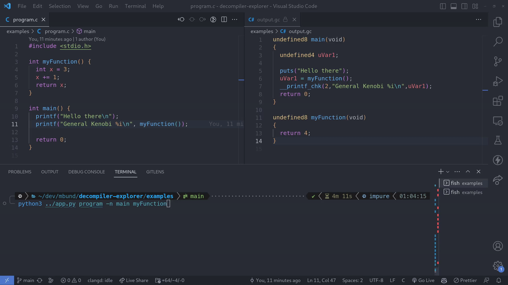

# Decompiler Explorer

Watch for changes in a binary and output a C-like decompilation.



## Usage

Run with nix

```
nix run github:mbund/decompiler-explorer
```

<details>
<summary>CLI Usage</summary>

```
usage: decompiler-explorer [-h] [-o OUTPUT] [-v] [-n FUNCTIONS [FUNCTIONS ...]] bin

Decompiler explorer

positional arguments:
  bin                   Path to binary used for analysis

options:
  -h, --help            show this help message and exit
  -o OUTPUT, --output OUTPUT
                        Location for all decompilations
  -v, --verbose         Verbose output
  -n FUNCTIONS [FUNCTIONS ...], --functions FUNCTIONS [FUNCTIONS ...]
                        Function names to decompile
```

</details>

Use something like [entr](https://github.com/eradman/entr) to watch for changes in a file and recompile.

```bash
examples$ find . -name '*.c' | entr make
```

Then also watch with the decompiler explorer.

```bash
examples$ decompiler-explorer program
```

Or with extra options

```bash
examples$ decompiler-explorer -o output.gc ./program -n main myFunction
```

`output.gc` is the default output file, where `.gc` is short for "C-like ghidra decompilation"

## VSCode tips

Set the language mode of the outputted C like code to `C#` or some other language where you don't have a language server set up that will just give errors, but still has good syntax highlighting.

Run `File: Toggle Active Editor Read-only in Session` to set the outputted C like code to read only, since it will always be overwritten by Decompiler Explorer if your source binary changes.
